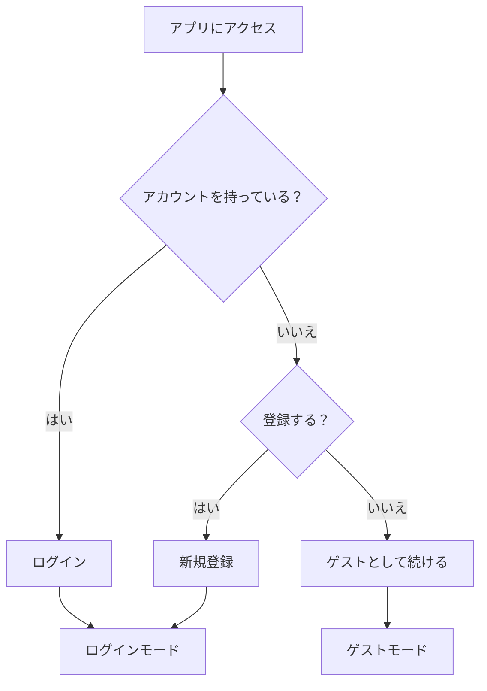
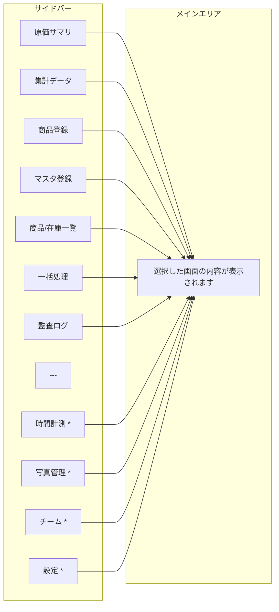

# コスト設計ダッシュボード 操作マニュアル

## このアプリについて

コスト設計ダッシュボードは、商品の原価計算・利益分析・在庫管理を一元的に行うためのアプリケーションです。
材料費・梱包費・人件費・外注費・開発費・設備費・物流費・光熱費・手数料の9つの原価区分を管理し、商品ごとの原価構成や利益率を可視化できます。

---

## 利用モード

このアプリには **ゲストモード** と **ログインモード** の2つの利用形態があります。

### ゲストモード

- アカウント登録なしですぐに使い始められます
- データはお使いのブラウザ内に保存されます
- **注意**: ブラウザのデータを消去すると、入力したデータも失われます
- 「デモデータ投入」で、あらかじめ用意されたサンプルデータを読み込んで試すことができます
- 手動で「バックアップ」からデータをファイルに保存し、「復元」で読み込むことができます

### ログインモード

- メールアドレスとパスワードで登録・ログインします
- データはクラウドに自動保存され、別の端末からもアクセスできます
- チーム機能、時間計測、写真管理、一括同期（スプレッドシート連携）が利用できます

---

## ログイン・新規登録の手順

### 新規登録

1. 画面左のサイドバー下部にある「**ログイン**」ボタンを押します
2. 表示されたログインパネルで以下を入力します
   - **氏名**（例: コスト太郎）
   - **メールアドレス**
   - **パスワード**（8文字以上）
3. 「**登録してログイン**」ボタンを押します
4. 登録が完了すると、自動的にログイン状態になります

### ログイン

1. サイドバー下部の「**ログイン**」ボタンを押します
2. **メールアドレス**と**パスワード**を入力します
3. 「**ログイン**」ボタンを押します

### パスワードを忘れた場合

1. ログインパネルで「**パスワードを忘れた方はこちら**」を押します
2. 登録済みのメールアドレスを入力します
3. 「**リセットメールを送信**」ボタンを押します
4. 届いたメールの案内に沿ってパスワードを再設定してください

### ログアウト

1. サイドバー下部の「**ログアウト**」ボタンを押します

> **補足**: ログアウト中にゲストモードでデータを追加した場合、次回ログイン時に「ローカルデータのマージ確認」が表示されます。「マージする」を選ぶとローカルデータがクラウドに統合され、「破棄する」を選ぶとローカルデータは削除されます。

---

## 画面構成

アプリは左側の **サイドバー** と右側の **メインエリア** で構成されています。

> **\*** がついた項目はログインモードのみ表示されます

### サイドバーの操作

- サイドバーの各メニューを押すと、対応する画面に切り替わります
- サイドバー上部の折りたたみボタンで、サイドバーの表示/非表示を切り替えられます
- スマートフォンでは左上のメニューボタン（≡）からサイドバーを開きます
- サイドバー上部のテーマ切替ボタンで、ライトモード/ダークモードを変更できます

---

## ゲストモード専用機能

サイドバー下部に以下の操作ボタンが表示されます。

| ボタン | 説明 |
|--------|------|
| **デモデータ投入** | サンプルの商品・マスタデータを読み込みます。初めて使うときにお試しください |
| **バックアップ** | 現在のデータをJSONファイルとしてダウンロードします |
| **復元** | バックアップファイルを選択してデータを復元します。**現在のデータは上書きされます** |
| **データクリア** | すべてのデータを消去します。**この操作は取り消せません** |

---

## 各画面の詳細

各画面の操作手順は、以下の個別マニュアルを参照してください。

| # | マニュアル | 内容 |
|---|-----------|------|
| 1 | [原価サマリ](./01-cost-summary.md) | 商品ごとの原価一覧・原価構成の確認 |
| 2 | [集計データ](./02-analytics.md) | 期間比較・ランキング・トレンド分析 |
| 3 | [商品登録](./03-product-registration.md) | 新規商品の登録・編集・原価明細の入力 |
| 4 | [マスタ登録](./04-master-registration.md) | 材料・梱包材・人件費レートなどの基礎データ管理 |
| 5 | [商品/在庫一覧](./05-product-stock-list.md) | 商品の検索・一覧表示・在庫管理 |
| 6 | [一括処理](./06-bulk-processing.md) | データの一括インポート・エクスポート |
| 7 | [監査ログ](./07-audit-log.md) | データ変更履歴の確認 |
| 8 | [時間計測](./08-time-tracking.md) | 作業時間の計測・記録（ログイン時のみ） |
| 9 | [写真管理](./09-photo-management.md) | 商品写真のアップロード・管理（ログイン時のみ） |
| 10 | [チーム管理](./10-team-management.md) | チームの作成・メンバー招待（ログイン時のみ） |
| 11 | [設定](./11-settings.md) | アカウント・通知の設定（ログイン時のみ） |

---

## キーボードショートカット

| ショートカット | 機能 |
|----------------|------|
| `Ctrl + K`（Mac: `⌘ + K`） | 検索欄にフォーカス |
| `?` | ショートカット一覧を表示 |
