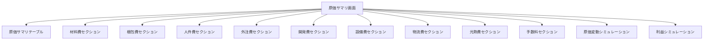
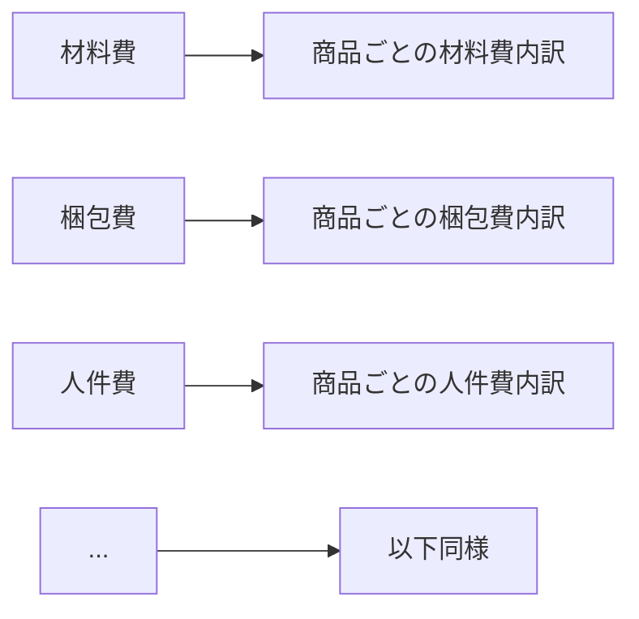
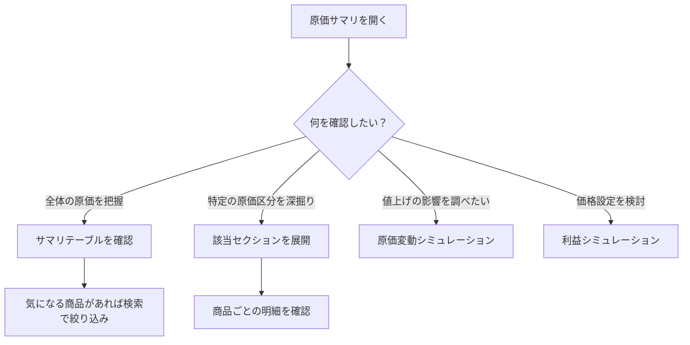

# 原価サマリ

サイドバーの「**原価サマリ**」を選択して表示します。
登録済みの全商品について、原価の内訳と合計を一覧で確認できる画面です。

---

## 画面の構成

この画面は複数のセクション（折りたたみ可能）で構成されています。

---

## 基本操作

### セクションの展開・折りたたみ

- 各セクションのヘッダー部分を押すと、展開/折りたたみを切り替えられます
- 画面上部の「**すべて展開**」「**すべて折りたたむ**」ボタンで一括操作も可能です

### 商品の検索・絞り込み

- 検索欄に商品名を入力すると、該当する商品だけに絞り込まれます
- カテゴリやステータスでフィルタすることも可能です

### 並び替え

- テーブルの列見出しを押すと、その項目で昇順/降順に並び替えられます
- 商品名、カテゴリ、金額などで並び替え可能です

---

## 原価サマリテーブル

全商品の原価を横断的に確認できるメインテーブルです。

| 表示項目 | 内容 |
|----------|------|
| 商品名 | 登録されている商品の名前 |
| 材料 / 梱包 / 人件費 / 外注 / 開発 / 設備 / 物流 / 電気 / 手数料 | 9区分それぞれの原価 |
| 合計 | 全区分の合計原価 |
| 実質利益率 | 販売価格に対する利益の割合（%） |
| 実質時給 | 作業時間あたりの実質的な収入 |

---

## 各原価セクション（材料費〜手数料）

9つの原価区分ごとに、商品別の明細を確認できます。

各セクションでは以下が確認できます：

- 商品ごとの該当区分の合計金額
- 明細（どの材料をいくら使っているかなど）
- 区分ごとの全商品合計

---

## 原価変動シミュレーション

「もしこの原価が変わったら？」を確認するための機能です。

### 使い方

1. 「**原価変動シミュレーション**」セクションを展開します
2. 変動させたい原価区分を選択します
3. 変動率（%）を入力します（例: +10%、-5% など）
4. 変動後の原価と利益率がリアルタイムで表示されます

### 活用例

- 材料費が10%値上がりした場合の利益率への影響を確認
- 人件費を削減した場合の原価改善効果を試算

---

## 利益シミュレーション

販売価格や生産量を変えた場合の利益を試算する機能です。

### 使い方

1. 「**利益シミュレーション**」セクションを展開します
2. 販売価格や生産数量を変更して、利益がどう変わるかを確認します
3. 複数の条件で比較しながら、最適な価格設定を検討できます

---

## よくある使い方

