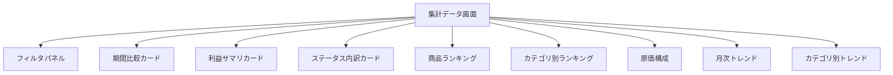
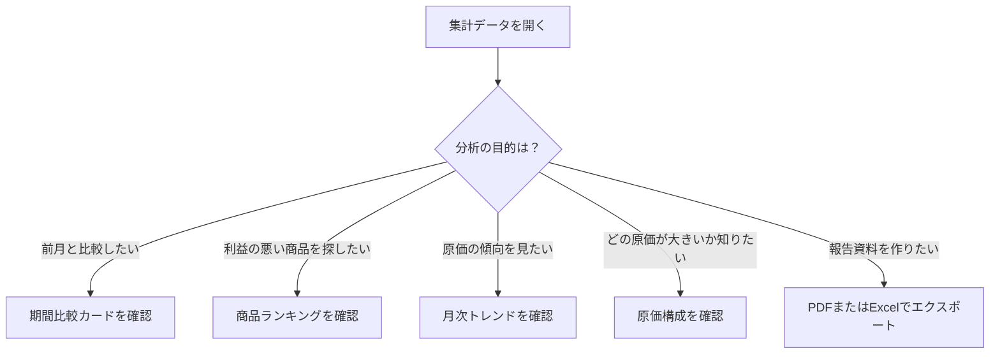

# 集計データ

サイドバーの「**集計データ**」を選択して表示します。
商品の原価・利益を期間ごとに集計し、トレンドやランキングを分析できる画面です。

---

## 画面の構成

---

## フィルタの設定

画面上部のフィルタパネルで、集計対象を絞り込めます。

| フィルタ項目 | 説明 |
|-------------|------|
| **期間** | 3ヶ月 / 6ヶ月 / 12ヶ月 / 24ヶ月から選択 |
| **カテゴリ** | 大カテゴリ・中カテゴリ・小カテゴリで絞り込み |

---

## 各セクションの見方

### 期間比較カード

選択した期間と前期間を比較し、指標の増減を表示します。

- 前期と比べて原価が上がったか下がったか
- 利益率の変動
- 増減を矢印や色で視覚的に表示

### 利益サマリカード

全体の利益に関する主要な数値をまとめて表示します。

### ステータス内訳カード

商品のステータス（下書き・有効・廃止）ごとの件数分布を表示します。

### 商品ランキング

商品を以下の基準でランキング表示します：

- 原価が高い順 / 低い順
- 数量が多い順
- 利益率が高い順 / 低い順

### カテゴリ別ランキング

大カテゴリ・中カテゴリ・小カテゴリ別に、原価や利益を集計してランキング表示します。

### 原価構成

9つの原価区分（材料費・梱包費・人件費など）が全体のどれくらいの割合を占めているかをグラフで表示します。

### 月次トレンド

月ごとの原価推移をグラフで表示します。原価が上がっている時期や季節的な傾向を把握できます。

### カテゴリ別トレンド

カテゴリごとの原価推移を時系列で表示します。

---

## データのエクスポート

集計データはPDFまたはExcelファイルとして出力できます。

### 手順

1. 画面上部のエクスポートボタンを押します
2. 出力形式（PDF / Excel）を選択します
3. ファイルが自動的にダウンロードされます

---

## 活用のポイント

