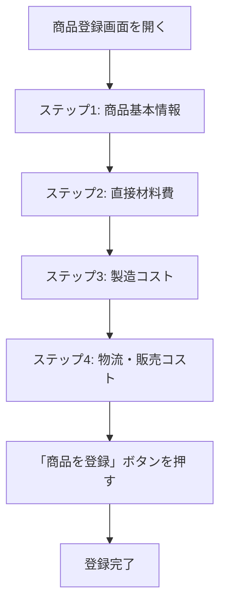
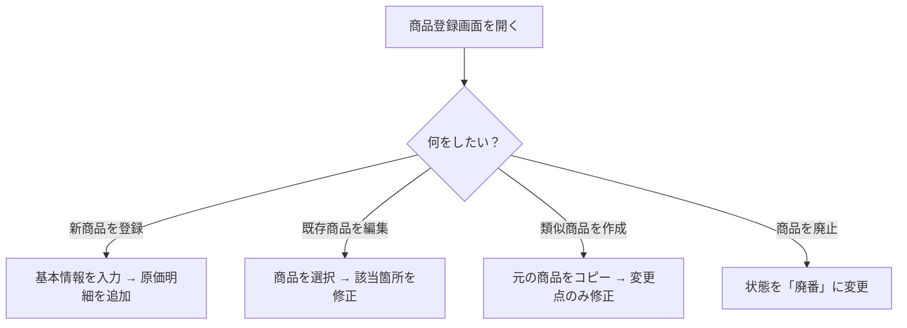

# 商品登録

サイドバーの「**商品登録**」を選択して表示します。
新しい商品を登録したり、既存の商品の情報や原価明細を編集する画面です。

---

## 商品登録の全体フロー

商品登録は **4つのステップ** に分かれたウィザード形式で進みます。

画面下部の「**次へ**」ボタンでステップを進め、「**戻る**」ボタンで前のステップに戻れます。
「**最終ステップへ**」ボタンを押すと、途中のステップを飛ばしてステップ4に進むこともできます。

> **補足**: 画面右側にはリアルタイムの原価サマリが表示され、入力中いつでも原価合計・利益率を確認できます。

---

## ステップ1: 商品基本情報

商品の基本的な情報を入力します。

| 項目 | 説明 |
|------|------|
| **商品名** | 商品の名前を入力します |
| **カテゴリ** | 大分類・中分類・小分類を選択します（マスタ登録で事前に登録が必要） |
| **販売価格** | 商品の販売単価を入力します |
| **生産ロット数** | 1回の生産で作る個数を入力します |
| **状態** | 「下書き」「販売中」「廃番」から選択します |
| **サイズバリエーション** | サイズ展開がある場合、ラベルと数量を追加します |
| **オプションプリセット** | マスタに登録済みのプリセットを選択して、バリエーションを一括設定できます |
| **初期在庫** | 初期の在庫数を入力します |
| **選択設備** | この商品の製造に使用する設備にチェックを入れます |
| **画像URL** | 商品の写真URLを設定します（写真管理からも選択可能） |
| **備考** | 自由記入のメモ欄です |

### 工程の定義（ステップ1内）

商品の製造工程もこのステップで定義します。

1. 「**工程を追加**」ボタンで工程を追加します
2. 工程名と想定時間を入力します
3. マスタの「工程テンプレート」を選択して一括適用することも可能です

> **補足**: 工程は時間計測機能と連携して、実際の作業時間を記録する際に使用します。

---

## ステップ2: 直接材料費

材料費と梱包費を入力するステップです。

> 「原価入力（商品登録内）」として、ここで入力した内容は原価サマリにも自動で反映されます。

### 材料費

マスタに登録された材料から選択し、使用量を入力します。

1. 「**追加**」ボタンを押します
2. 材料をドロップダウンから選択します
3. 使用量（数量またはパーセント）を入力します
4. 自動的に金額が計算されます

### 梱包費

マスタに登録された梱包材から選択し、数量を入力します。

1. 「**追加**」ボタンを押します
2. 梱包材を選択します
3. 使用数量を入力します

---

## ステップ3: 製造コスト

人件費・外注費・開発費・設備配賦を入力するステップです。

### 人件費

作業に関わる人員の役割と時間を入力します。

1. 「**追加**」ボタンを押します
2. 人件費レート（役割）をマスタから選択します
3. 作業時間を入力します
4. 時間単価 × 作業時間で金額が計算されます

### 外注費

外部に委託する作業の費用を入力します。

1. 「**追加**」ボタンを押します
2. 外注内容と費用を入力します

### 開発費

商品の開発・設計にかかる費用を入力します。

1. 「**追加**」ボタンを押します
2. 開発費の内容と金額を入力します

### 設備配賦

ステップ1で選択した設備の割当情報が表示されます。設備の使用時間に応じたコストが自動で計算されます。

---

## ステップ4: 物流・販売コスト

物流費・手数料・電気代を入力するステップです。

### 物流費

配送方法をマスタから選択し、費用を入力します。

1. 「**追加**」ボタンを押します
2. 配送方法を選択します
3. 数量と費用を入力します

### 手数料

決済手数料やプラットフォーム手数料などを入力します。

1. 「**追加**」ボタンを押します
2. 手数料をマスタから選択します
3. 固定額または販売価格に対する割合（%）で金額が計算されます

### 電気代

電力消費にかかる費用を入力します。

1. 「**追加**」ボタンを押します
2. 使用時間とレートを入力します

### 登録の完了

すべての入力が終わったら、「**商品を登録**」ボタン（編集時は「**商品を更新**」ボタン）を押して保存します。

---

## 商品のコピー

既存の商品をコピーして新しい商品を作成できます。

1. コピーしたい商品を表示した状態で「**コピー**」ボタンを押します
2. 商品名が「（商品名）のコピー」として複製されます
3. 原価明細もすべてコピーされます
4. 必要に応じて商品名や明細を修正します

> **活用例**: サイズ違いや味違いの商品を登録する際、ベースとなる商品をコピーして一部を変更するだけで済みます。

---

## 商品の削除

1. 削除したい商品を表示した状態で「**削除**」ボタンを押します
2. 確認ダイアログが表示されます：「商品を削除しますか？」
3. 「**削除する**」を押すと、商品と関連する原価明細がすべて削除されます

> **注意**: 削除した商品は元に戻せません。

---

## よくある使い方

### 効率的な登録のコツ

1. **先にマスタを登録する**: 材料・梱包材・人件費レート・設備・配送方法・手数料は、マスタ登録画面で先に登録しておくとスムーズです
2. **コピー機能を活用する**: 似た商品はコピーしてから修正すると効率的です
3. **下書き状態を活用する**: 情報が揃わない段階では「下書き」で保存し、確定したら「販売中」に変更します
