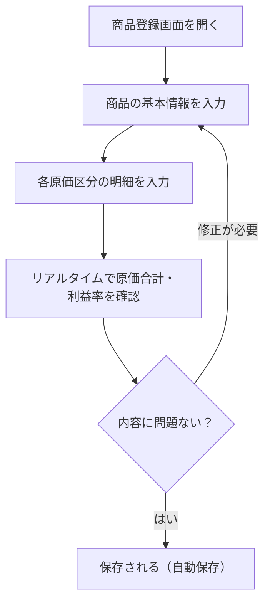
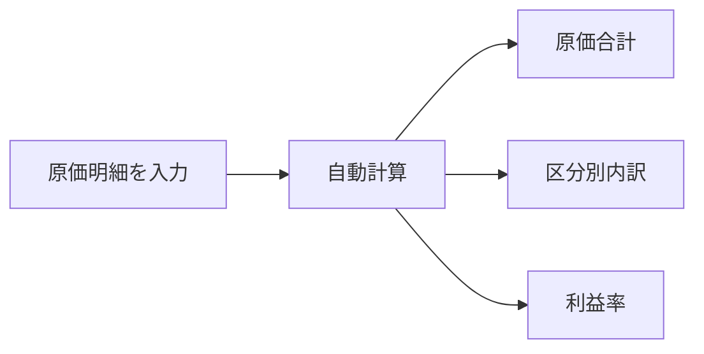
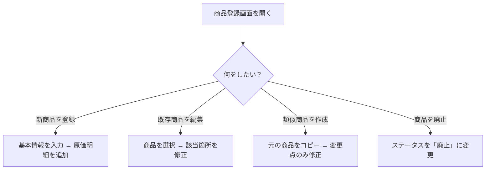

# 商品登録

サイドバーの「**商品登録**」を選択して表示します。
新しい商品を登録したり、既存の商品の情報や原価明細を編集する画面です。

---

## 商品登録の全体フロー

---

## 商品の基本情報

画面上部で商品の基本情報を入力します。

| 項目 | 説明 |
|------|------|
| **商品名** | 商品の名前を入力します |
| **カテゴリ** | 大カテゴリ・中カテゴリ・小カテゴリを選択します（マスタ登録で事前に登録が必要） |
| **サイズ** | サイズ展開がある場合、バリエーションと数量を設定します |
| **販売価格** | 商品の販売単価を入力します |
| **生産ロット** | 1回の生産で作る個数を入力します |
| **想定生産量** | 期間あたりの生産予定数を入力します |
| **想定生産期間** | 生産量の対象期間を入力します |
| **登録日** | 商品の登録日を設定します |
| **ステータス** | 「下書き」「有効」「廃止」から選択します |
| **基準工数** | 1個あたりの基準となる作業時間（人時）を入力します |
| **備考** | 自由記入のメモ欄です |
| **商品画像** | 商品の写真URLを設定します（写真管理からも選択可能） |

---

## 原価明細の入力

商品の基本情報の下に、9つの原価区分のセクションが並んでいます。各セクションを展開して明細を入力します。

### 材料費

マスタに登録された材料から選択し、使用量を入力します。

1. 「**追加**」ボタンを押します
2. 材料をドロップダウンから選択します
3. 使用量（数量またはパーセント）を入力します
4. 自動的に金額が計算されます

### 梱包費

マスタに登録された梱包材から選択し、数量を入力します。

1. 「**追加**」ボタンを押します
2. 梱包材を選択します
3. 使用数量を入力します

### 人件費

作業に関わる人員の役割と時間を入力します。

1. 「**追加**」ボタンを押します
2. 人件費レート（役割）をマスタから選択します
3. 作業時間を入力します
4. 時間単価 × 作業時間で金額が計算されます

### 外注費

外部に委託する作業の費用を入力します。

1. 「**追加**」ボタンを押します
2. 外注内容と費用を入力します

### 開発費

商品の開発・設計にかかる費用を入力します。

1. 「**追加**」ボタンを押します
2. 開発費の内容と金額を入力します

### 設備費

使用する設備をマスタから選択し、使用時間を入力します。

1. 「**追加**」ボタンを押します
2. 設備を選択します
3. 使用時間（割当時間）を入力します
4. 設備の時間コストから金額が計算されます

### 物流費

配送方法をマスタから選択し、費用を入力します。

1. 「**追加**」ボタンを押します
2. 配送方法を選択します
3. 費用を入力します

### 光熱費

電力消費などの光熱費を入力します。

1. 「**追加**」ボタンを押します
2. 内容と金額を入力します

### 手数料

決済手数料やプラットフォーム手数料などを入力します。

1. 「**追加**」ボタンを押します
2. 手数料をマスタから選択します
3. 固定額または販売価格に対する割合（%）で金額が計算されます

---

## 工程の定義

商品の製造工程を定義できます。時間計測機能と連携して、実際の作業時間を記録する際に使用します。

1. 「**工程**」セクションを展開します
2. 工程名と順序を入力します
3. 各工程に対して想定時間を設定します
4. マスタに登録された工程テンプレートを適用することもできます

---

## リアルタイム原価確認

画面の右側（または下部）に、入力した原価の合計がリアルタイムで表示されます。

- 原価区分ごとの小計
- 全体の原価合計
- 販売価格に対する利益率

明細を追加・変更するたびに、自動的に再計算されます。

---

## 商品のコピー

既存の商品をコピーして新しい商品を作成できます。

1. コピーしたい商品を表示した状態で「**コピー**」ボタンを押します
2. 商品名が「（商品名）のコピー」として複製されます
3. 原価明細もすべてコピーされます
4. 必要に応じて商品名や明細を修正します

> **活用例**: サイズ違いや味違いの商品を登録する際、ベースとなる商品をコピーして一部を変更するだけで済みます。

---

## 商品の削除

1. 削除したい商品を表示した状態で「**削除**」ボタンを押します
2. 確認ダイアログが表示されます：「商品を削除しますか？」
3. 「**削除する**」を押すと、商品と関連する原価明細がすべて削除されます

> **注意**: 削除した商品は元に戻せません。

---

## よくある使い方

### 効率的な登録のコツ

1. **先にマスタを登録する**: 材料・梱包材・人件費レート・設備・配送方法・手数料は、マスタ登録画面で先に登録しておくとスムーズです
2. **コピー機能を活用する**: 似た商品はコピーしてから修正すると効率的です
3. **下書きステータスを活用する**: 情報が揃わない段階では「下書き」で保存し、確定したら「有効」に変更します
