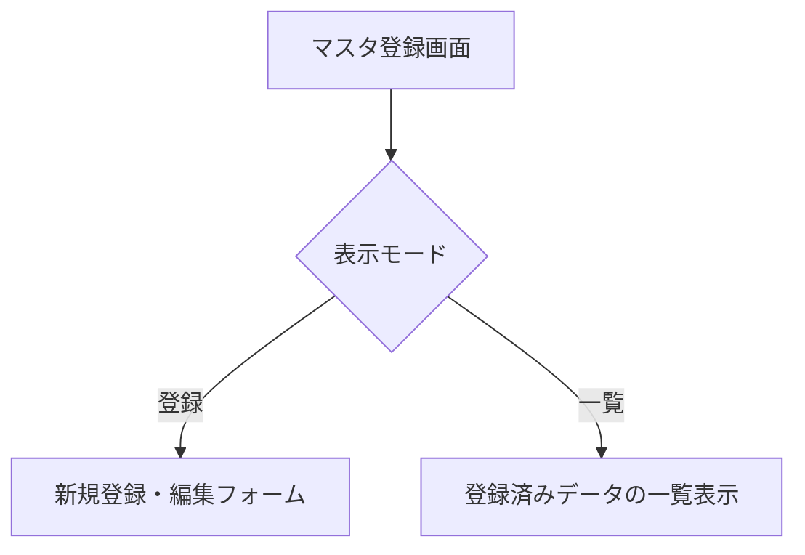
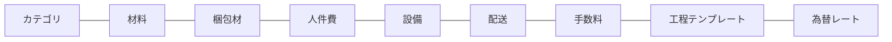
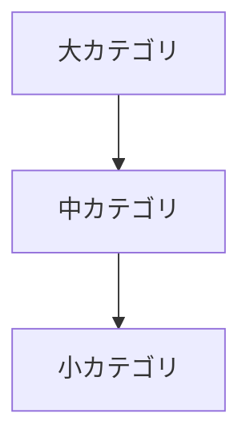
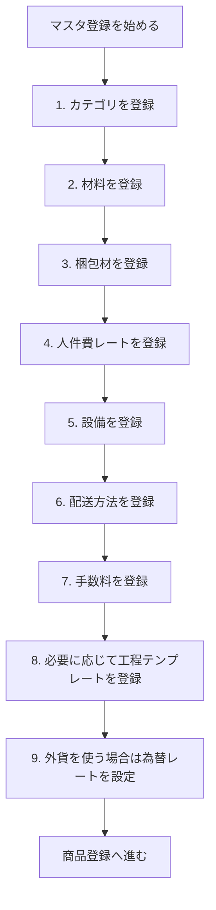

# マスタ登録

サイドバーの「**マスタ登録**」を選択して表示します。
商品登録で使用する基礎データ（材料、梱包材、人件費レート、設備など）を管理する画面です。

> **重要**: マスタデータは商品登録の際に選択肢として表示されます。商品を登録する前に、必要なマスタデータを先に登録しておくことをお勧めします。

---

## 画面の構成

マスタ登録画面は「**登録**」と「**一覧**」の2つの表示モードがあります。

画面上部のタブで以下のマスタ区分を切り替えます：

---

## カテゴリ

商品を分類するためのカテゴリを3階層で管理します。

### 階層構造

**例**: 大カテゴリ「食品」→ 中カテゴリ「焼き菓子」→ 小カテゴリ「クッキー」

### 登録手順

1. 「**カテゴリ**」タブを選択します
2. 登録したい階層（大・中・小）を選びます
3. カテゴリ名を入力します
4. 中カテゴリの場合は親となる大カテゴリを選択します
5. 小カテゴリの場合は親となる中カテゴリを選択します
6. 保存します

### 操作

| 操作 | 説明 |
|------|------|
| 追加 | 新しいカテゴリを登録します |
| 編集 | カテゴリ名を変更します |
| コピー | 同じ内容で複製します |
| 削除 | カテゴリを削除します。**関連する子カテゴリも一緒に削除されます** |
| 一括削除 | チェックを入れた複数のカテゴリを一度に削除します |

> **注意**: 大カテゴリを削除すると、紐づく中カテゴリ・小カテゴリもすべて削除され、該当商品のカテゴリ設定も解除されます。

---

## 材料

商品に使う原材料・部材を管理します。

### 登録項目

| 項目 | 説明 |
|------|------|
| **材料名** | 材料の名前 |
| **単位** | 計量単位（g、ml、個 など） |
| **サイズ説明** | サイズや規格の補足説明 |
| **単価** | 1単位あたりの価格 |
| **通貨** | 価格の通貨（円・ドル・ユーロ） |
| **ロット数量** | 仕入れ単位の数量 |
| **単位モード** | 「数量」または「パーセント」で使用量を指定する方式 |
| **仕入先** | 仕入先の名称 |

### 在庫管理

ログインモードでは、材料の在庫数を管理できます。

- **残数の確認**: 現在の在庫数が表示されます
- **在庫の追加**: 仕入れ時に在庫を追加します
- **在庫の使用**: 使用分を差し引きます
- **アラート設定**: 在庫が一定数を下回った場合に通知するしきい値を設定できます

---

## 梱包材

商品の梱包に使用する資材を管理します。

### 登録項目

| 項目 | 説明 |
|------|------|
| **梱包材名** | 梱包材の名前 |
| **仕様** | 規格やサイズなどの説明 |
| **単価** | 1個あたりの価格 |
| **通貨** | 価格の通貨 |

梱包材も材料と同様に在庫管理が可能です。

---

## 人件費

作業者の役割（職種）ごとの時間単価を管理します。

### 登録項目

| 項目 | 説明 |
|------|------|
| **役割名** | 作業者の役割（例: 製造スタッフ、検品担当、包装担当） |
| **時間単価** | 1時間あたりの人件費 |
| **通貨** | 価格の通貨 |
| **関連設備** | この役割が使用する設備（任意） |

### 登録手順

1. 「**人件費**」タブを選択します
2. 「**追加**」ボタンを押します
3. 役割名と時間単価を入力します
4. 必要に応じて関連設備を選択します
5. 保存します

---

## 設備

製造に使用する設備・機器を管理します。

### 登録項目

| 項目 | 説明 |
|------|------|
| **設備名** | 設備の名前 |
| **固定費** | 設備の購入費用や固定的なコスト |
| **時間コスト** | 1時間あたりの運転コスト |
| **償却期間** | 設備費用を分割する期間 |

### 設備シミュレーション

設備の配分コストを試算する機能があります。設備の使用時間や配分方法を変更した場合の商品あたりのコスト変動を確認できます。

---

## 配送

配送方法と費用を管理します。

### 登録項目

| 項目 | 説明 |
|------|------|
| **配送方法名** | 配送方法の名前（例: 宅配便、クール便、メール便） |
| **費用** | 配送にかかる金額 |
| **通貨** | 価格の通貨 |

---

## 手数料

決済手数料やプラットフォーム利用料などを管理します。

### 登録項目

| 項目 | 説明 |
|------|------|
| **手数料名** | 手数料の名前（例: クレジットカード手数料、プラットフォーム手数料） |
| **計算方法** | 「固定額」または「割合（%）」を選択 |
| **金額 / 割合** | 固定額の場合は金額、割合の場合はパーセンテージを入力 |

---

## 工程テンプレート

よく使う製造工程のひな形を登録できます。商品登録時に工程テンプレートを適用すると、工程を一括設定できます。

### 登録手順

1. 「**工程テンプレート**」タブを選択します
2. テンプレート名を入力します
3. 工程を順番に追加します（工程名・想定時間）
4. 保存します

### 活用方法

商品登録画面の「工程」セクションで、登録済みのテンプレートを選択して適用できます。

---

## 為替レート

複数通貨で原価を管理する場合の為替レートを設定します。

### 対応通貨

- 日本円（JPY）
- 米ドル（USD）
- ユーロ（EUR）

### 操作

- 手動でレートを入力できます
- ログインモードでは、最新レートの取得ボタンでレートを更新できます

> **補足**: 為替レートは、異なる通貨で登録された材料費等を円換算する際に使用されます。

---

## マスタ登録の推奨手順

> **ヒント**: すべてのマスタを一度に登録する必要はありません。商品登録で必要になった項目から随時追加していくことも可能です。
