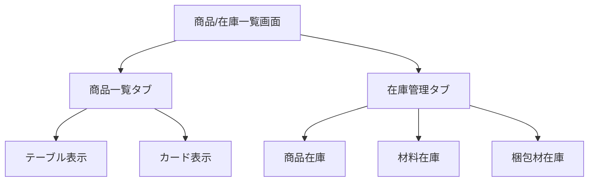
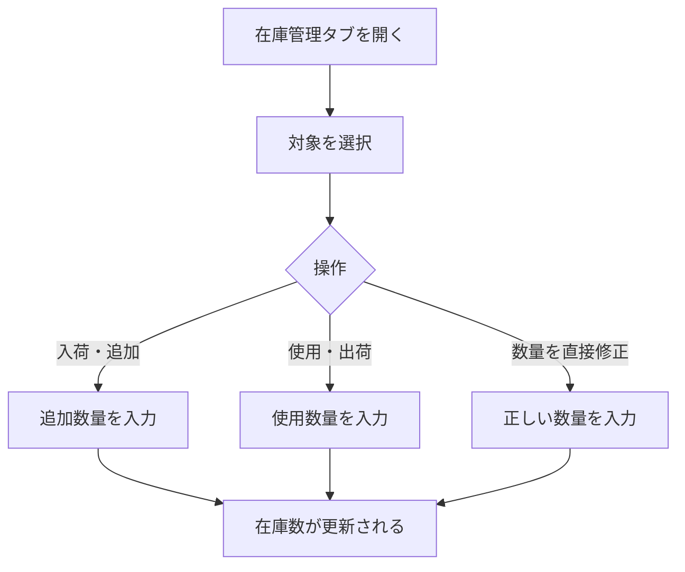
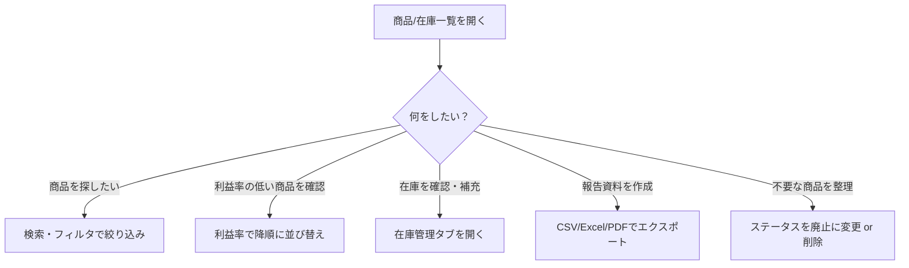

# 商品/在庫一覧

サイドバーの「**商品/在庫一覧**」を選択して表示します。
登録済みの全商品を一覧で確認し、検索・絞り込み・在庫管理を行う画面です。

---

## 画面の構成

この画面は「**商品一覧**」タブと「**在庫管理**」タブで構成されています。

---

## 商品一覧

### 表示の切り替え

画面右上の切り替えボタンで、2つの表示形式を選べます。

| 表示形式 | 特徴 |
|----------|------|
| **テーブル表示** | 詳細な情報を列ごとに表示。並び替えや列のカスタマイズが可能 |
| **カード表示** | 商品ごとにカード形式で表示。ビジュアルで確認しやすい |

### テーブル表示の列

| 列名 | 内容 |
|------|------|
| 商品名 | 商品の名前 |
| カテゴリ | 大・中・小カテゴリ |
| ステータス | 下書き / 有効 / 廃止 |
| 販売価格 | 設定された販売単価 |
| 原価合計 | 全原価区分の合計 |
| 利益率 | （販売価格 − 原価合計）÷ 販売価格 |
| 在庫数 | 現在の在庫数量 |
| 更新日 | 最終更新日時 |

### 列のカスタマイズ

テーブル表示では、表示する列を選択できます。

1. 列設定ボタンを押します
2. 表示したい列にチェックを入れます
3. 不要な列のチェックを外します

### 検索・フィルタ

- **検索**: 検索欄に商品名やキーワードを入力して絞り込みます
- **カテゴリフィルタ**: 特定のカテゴリの商品のみ表示します
- **ステータスフィルタ**: 下書き・有効・廃止で絞り込みます

### 並び替え

テーブルの列見出しを押すと、昇順/降順で並び替えられます。

### 商品の操作

一覧から各商品に対して以下の操作ができます。

| 操作 | 説明 |
|------|------|
| **編集** | 商品登録画面に移動して編集します |
| **コピー** | 商品を複製して新しい商品を作成します |
| **削除** | 商品を削除します（確認ダイアログあり） |

### 一括削除

複数の商品をまとめて削除できます。

1. 削除したい商品にチェックを入れます
2. 「**一括削除**」ボタンを押します
3. 確認ダイアログで件数を確認し、「**削除**」を押します

> **注意**: 一括削除は取り消せません。

---

## データのエクスポート

商品一覧のデータをファイルとして出力できます。

### 手順

1. エクスポートボタンを押します
2. 出力形式を選択します：
   - **CSV**: 表計算ソフトで開ける形式
   - **Excel**: Excel形式のファイル
   - **PDF**: 印刷用のPDF形式
3. ファイルが自動的にダウンロードされます

---

## 在庫管理

「**在庫管理**」タブでは、商品・材料・梱包材の在庫を管理します。

### 在庫の確認

3つのカテゴリの在庫を確認できます：

| カテゴリ | 説明 |
|----------|------|
| **商品在庫** | 完成品の在庫数 |
| **材料在庫** | 原材料・部材の在庫数 |
| **梱包材在庫** | 梱包資材の在庫数 |

### 在庫数の変更

### 在庫アラートの設定

在庫が少なくなった際に通知を受け取るためのしきい値を設定できます。

1. 対象の商品・材料・梱包材を選択します
2. アラートしきい値（最低在庫数）を入力します
3. 在庫がしきい値を下回ると、通知が表示されます

> **補足**: アラートしきい値は品目ごとに個別に設定できます。

---

## 活用のポイント

