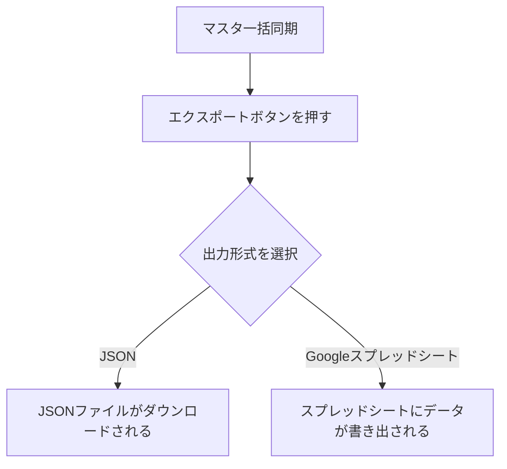
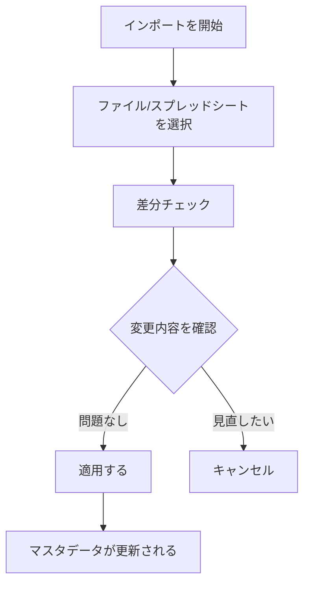
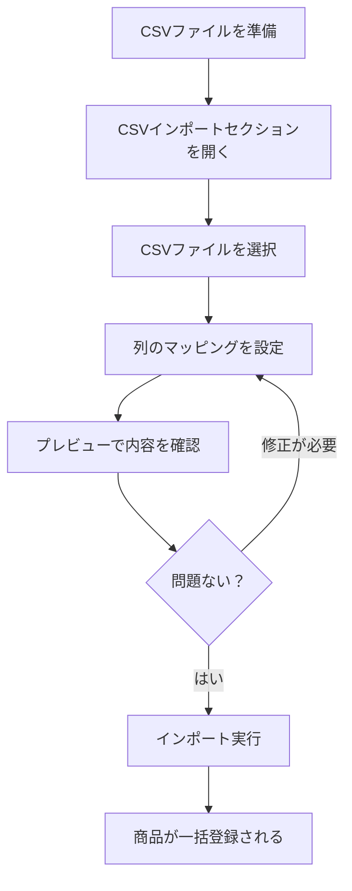

# 一括処理

サイドバーの「**一括処理**」を選択して表示します。
マスタデータや商品データをまとめてインポート・エクスポートする画面です。

> **注意**: スプレッドシート連携（Googleスプレッドシートとの同期）はログインモードでのみ利用できます。ゲストモードではJSON形式でのインポート・エクスポートが利用可能です。

---

## 画面の構成

---

## マスタ一括同期

マスタデータ（材料・梱包材・配送・人件費・設備・手数料・カテゴリ）を一括でエクスポート・インポートします。

### エクスポート（書き出し）

#### JSON形式でのエクスポート

1. 「**エクスポート**」ボタンを押します
2. JSON形式を選択します
3. マスタデータがJSONファイルとしてダウンロードされます

#### Googleスプレッドシートへのエクスポート（ログインモードのみ）

1. 「**エクスポート**」ボタンを押します
2. Googleスプレッドシートを選択します
3. 連携先のスプレッドシートにデータが書き出されます

### インポート（読み込み）

1. 「**インポート**」ボタンを押します
2. JSONファイルまたはGoogleスプレッドシートを指定します
3. **差分チェック**が実行されます：現在のデータと読み込むデータの違いが表示されます
4. 変更内容を確認します
5. 問題なければ「**適用**」を押します
6. マスタデータが更新されます

> **ポイント**: インポート前に必ず差分チェックの内容を確認してください。意図しないデータの上書きを防げます。

---

## 商品一括同期

商品データを一括でエクスポート・インポートします。操作手順はマスタ一括同期と同様です。

### エクスポート

1. 「**エクスポート**」ボタンを押します
2. 出力形式（JSON / Googleスプレッドシート）を選択します
3. 全商品データが出力されます

### インポート

1. 「**インポート**」ボタンを押します
2. ファイルまたはスプレッドシートを指定します
3. 差分チェックで変更内容を確認します
4. 「**適用**」を押して商品データを更新します

---

## 商品CSVインポート

CSV（カンマ区切り）ファイルから商品を一括登録する機能です。

### 手順

1. **CSVファイルの準備**: 表計算ソフトなどで商品データをCSV形式で保存します
2. **ファイルの選択**: 「CSVインポート」セクションでファイルを選択します
3. **列のマッピング**: CSVの各列が、アプリのどの項目に対応するかを設定します
   - 例: 1列目 → 商品名、2列目 → 販売価格、3列目 → カテゴリ...
4. **プレビュー確認**: 読み込まれるデータの内容を確認します
5. **インポート実行**: 問題なければ実行し、商品が一括登録されます

### CSVファイルの準備について

- 1行目は見出し行として扱われます
- 文字コードはUTF-8を推奨します
- 表計算ソフト（Excel、Googleスプレッドシートなど）から「CSV形式で保存」で作成できます

---

## 活用のポイント

| シーン | おすすめ機能 |
|--------|-------------|
| 別の端末にデータを移したい | JSONエクスポート → インポート |
| スプレッドシートでデータを管理したい | Googleスプレッドシート連携（ログイン必須） |
| 大量の商品を一気に登録したい | CSVインポート |
| 定期的にバックアップを取りたい | マスタ・商品の両方をJSONエクスポート |
| チームでマスタデータを共有したい | スプレッドシートを経由して同期 |

> **注意**: インポートは既存データを上書きする場合があります。重要なデータは事前にバックアップ（エクスポート）を取ることをお勧めします。
