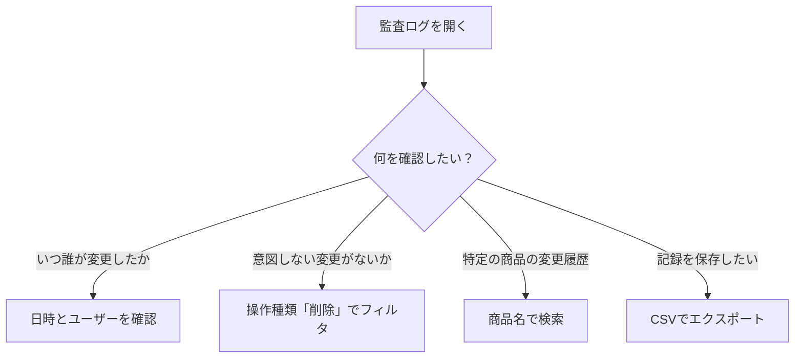

# 監査ログ

サイドバーの「**監査ログ**」を選択して表示します。
アプリ内で行われたすべてのデータ変更（追加・更新・削除）の履歴を確認できる画面です。

---

## 画面の構成

監査ログは時系列のテーブル形式で表示されます。

### 表示される情報

| 列名 | 内容 |
|------|------|
| **日時** | 変更が行われた日時 |
| **ユーザー/端末** | 変更を行ったユーザー名または端末情報 |
| **操作** | 変更の種類（追加 / 更新 / 削除） |
| **対象** | 変更された項目の種類と名前 |
| **変更内容** | 追加・更新・削除されたフィールドの概要 |

---

## 基本操作

### 検索

検索欄にキーワードを入力して、特定の変更履歴を探せます。

### フィルタ

- **期間指定**: 特定の期間の変更のみを表示します
- **操作種類**: 追加・更新・削除のいずれかで絞り込みます

### 並び替え

列見出しを押すと、昇順/降順で並び替えられます。

### さらに読み込む

表示件数が多い場合、画面下部の「**さらに読み込む**」ボタンで過去の履歴を追加表示します。

### 更新

「**更新**」ボタンで最新のログを再読み込みします。

---

## エクスポート

監査ログをCSVファイルとしてエクスポートできます。

1. エクスポートボタンを押します
2. CSVファイルがダウンロードされます

---

## 活用例

> **補足**: 監査ログは自動的に記録されます。手動で追加・編集することはできません。
