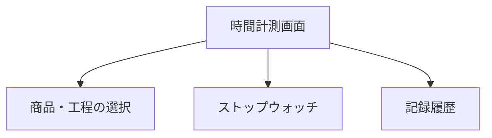
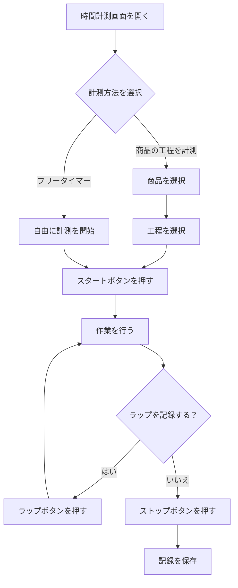
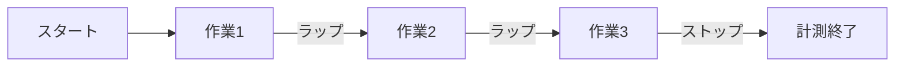
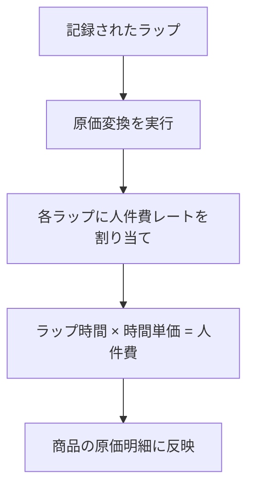

# 時間計測

サイドバーの「**時間計測**」を選択して表示します。
製造工程の作業時間をストップウォッチで計測し、記録・管理する画面です。

> **注意**: この機能はログインモードでのみ利用できます。

---

## 画面の構成

---

## 計測の全体フロー

---

## 商品・工程の選択

### 商品の工程を計測する場合

1. ドロップダウンから計測したい**商品**を選択します
2. その商品に登録されている**工程**が一覧で表示されます
3. 計測したい工程を選択します

### フリータイマーの場合

商品や工程を選択せず、自由にストップウォッチを使えます。後から作業名を設定できます。

---

## ストップウォッチの操作

| ボタン | 動作 |
|--------|------|
| **スタート** | 計測を開始します |
| **一時停止** | 計測を一時的に停止します（再開可能） |
| **再開** | 一時停止した計測を再開します |
| **ラップ** | 現在の経過時間をラップとして記録します。計測は継続します |
| **ストップ** | 計測を終了します |

### ラップの活用

ラップ機能を使うと、1回の計測の中で区切りを記録できます。

**例**: 「生地作り → 成形 → 焼成 → 仕上げ」の各工程の切り替わりでラップを押す

各ラップにはラベル（名前）を付けることができます。

---

## 記録の保存

計測を終了すると、記録を保存できます。

1. ストップボタンを押して計測を終了します
2. 必要に応じてメモを入力します
3. 「**保存**」ボタンを押します
4. 「記録を保存しました」と表示されれば完了です

---

## ラップの原価変換

記録したラップを、商品の原価（人件費）として登録できます。

### 手順

1. 保存済みの記録から変換したいラップを選択します
2. 各ラップに対して人件費レート（役割）を割り当てます
3. 時間単価が自動的に適用され、金額が計算されます
4. 「**保存**」を押すと商品の原価明細に追加されます

> **活用例**: 実際の作業時間を計測して、より正確な人件費を原価に反映できます。

---

## 記録履歴

過去の計測記録を一覧で確認できます。

### 表示項目

| 項目 | 内容 |
|------|------|
| **作業名** | 計測時に設定した名前 |
| **商品** | 紐づけた商品名 |
| **工程** | 紐づけた工程名 |
| **合計時間** | 計測の合計時間 |
| **ラップ数** | 記録したラップの数 |
| **日時** | 計測を行った日時 |

### 操作

- **検索**: 作業名で検索できます
- **編集**: メモの追加・修正ができます
- **削除**: 不要な記録を削除できます（確認ダイアログあり）

---

## 活用のポイント

| シーン | 使い方 |
|--------|--------|
| 新商品の工数を見積もりたい | 試作時にストップウォッチで計測し、実測値を把握する |
| 原価の人件費を実績ベースにしたい | ラップの原価変換で、実際の作業時間から人件費を算出する |
| 作業の効率を改善したい | 同じ工程を複数回計測し、時間の推移を比較する |
| 工程テンプレートを作りたい | 計測結果をもとに標準工程の時間を設定する |
