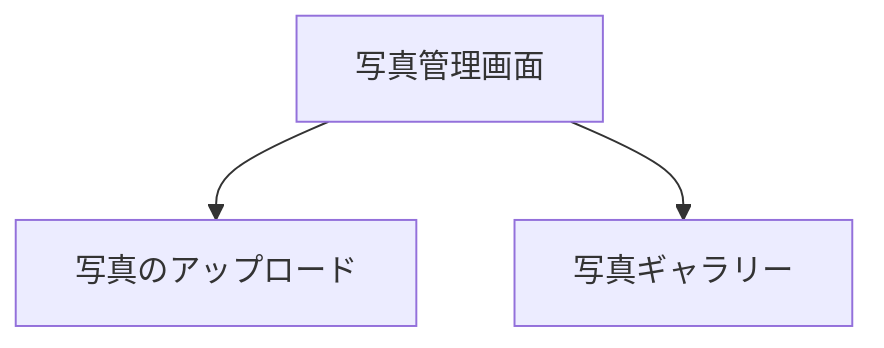
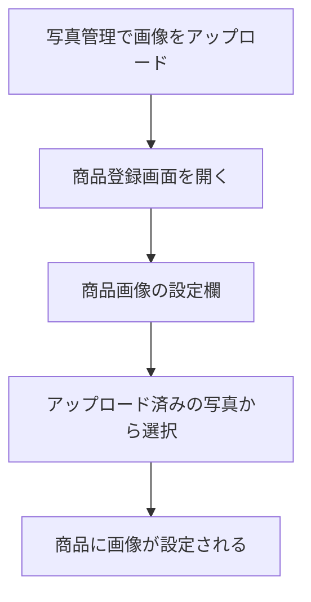

# 写真管理

サイドバーの「**写真管理**」を選択して表示します。
商品画像のアップロード・管理を行う画面です。

> **注意**: この機能はログインモードでのみ利用できます。

---

## 画面の構成

---

## 写真のアップロード

### 手順

1. 「**写真管理**」画面を開きます
2. アップロードボタンを押します
3. 端末から画像ファイルを選択します（またはカメラで撮影します）
4. アップロードが完了すると、ギャラリーに追加されます

### 対応形式

一般的な画像形式（JPEG、PNGなど）に対応しています。

---

## 写真ギャラリー

アップロード済みの写真が一覧で表示されます。

### 操作

- 写真を選択して詳細を確認できます
- 不要な写真を削除できます

---

## 商品への画像設定

アップロードした写真は、商品登録画面で商品画像として設定できます。

### 手順

1. 事前に「写真管理」で画像をアップロードしておきます
2. 「商品登録」画面で対象の商品を開きます
3. 商品画像の設定欄で、アップロード済みの画像URLを指定します
4. 商品に画像が表示されるようになります

---

## 活用のポイント

| シーン | 使い方 |
|--------|--------|
| 商品の見た目を記録したい | 製造後に写真を撮影してアップロード |
| 商品一覧で画像を表示したい | アップロード後、商品登録で画像を設定 |
| チームで商品イメージを共有したい | 写真をアップロードしておけばチームメンバーも閲覧可能 |
