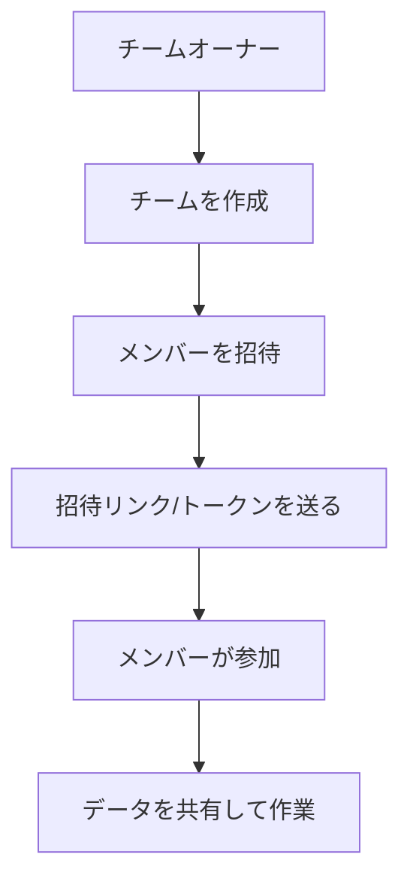
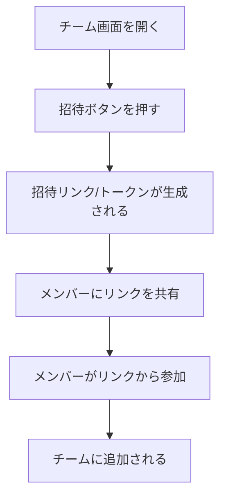

# チーム管理

サイドバーの「**チーム**」を選択して表示します。
チームの作成、メンバーの招待・管理を行う画面です。

> **注意**: この機能はログインモードでのみ利用できます。

---

## チームとは

チームを作成すると、複数のメンバーでデータを共有して共同作業できます。

---

## 役割と権限

チームには3つの役割があります。

| 役割 | できること |
|------|-----------|
| **オーナー** | すべての操作（チーム削除を含む） |
| **管理者** | メンバーの役割変更、招待、データの編集 |
| **メンバー** | データの閲覧・編集 |

---

## チームの作成

1. 「**チーム**」画面を開きます
2. 「**新しいチームを作成**」ボタンを押します
3. チーム名を入力します
4. 作成ボタンを押します
5. 作成者が自動的にオーナーになります

---

## チームの切り替え

複数のチームに所属している場合、チーム一覧から切り替えられます。

1. チーム一覧から参加したいチームを選択します
2. 選択したチームのデータに切り替わります

---

## メンバーの招待

### 手順

1. チーム画面で「**招待**」ボタンを押します
2. 招待用のリンクまたはトークンが生成されます
3. メールやチャットなどで、参加してほしい人にリンクを送ります
4. 受け取った人がリンクを開くと、チームに参加できます

---

## メンバーの管理

### メンバー一覧の確認

チーム画面でメンバーの一覧が表示されます。各メンバーの役割（オーナー/管理者/メンバー）が確認できます。

### 役割の変更（管理者以上）

1. 変更したいメンバーを選択します
2. 新しい役割を選択します
3. 変更が保存されます

---

## チームからの脱退

オーナー以外のメンバーは、チームから脱退できます。

1. チーム画面で「**脱退**」ボタンを押します
2. 確認ダイアログで「脱退する」を押します

> **注意**: オーナーはチームから脱退できません。先に別のメンバーにオーナー権限を移すか、チームを削除してください。

---

## チームの削除

チームの削除はオーナーのみ実行できます。

1. チーム画面で「**チームを削除**」ボタンを押します
2. 確認ダイアログが表示されます
3. 「**削除する**」を押します

> **注意**: チームを削除すると、チームのデータにアクセスできなくなります。この操作は取り消せません。

---

## 活用のポイント

| シーン | 使い方 |
|--------|--------|
| 複数人で原価管理をしたい | チームを作成してメンバーを招待 |
| 部門ごとにデータを分けたい | 部門ごとに別のチームを作成 |
| 外部パートナーとデータを共有したい | チームに招待して「メンバー」役割で参加してもらう |
