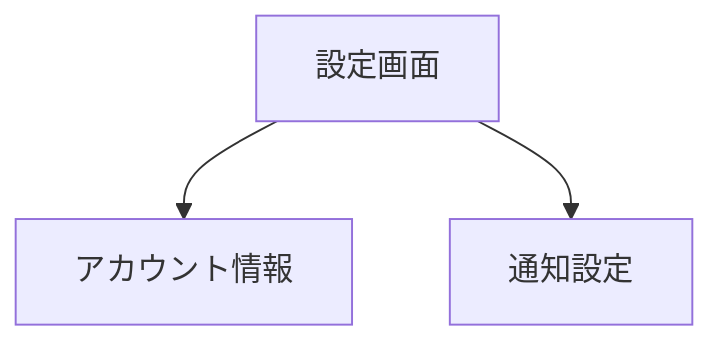
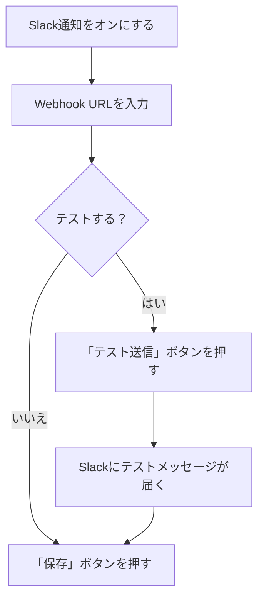

# 設定

サイドバーの「**設定**」を選択して表示します。
アカウント情報と通知の設定を管理する画面です。

> **注意**: この機能はログインモードでのみ利用できます。

---

## 画面の構成

---

## アカウント情報

現在ログインしているアカウントの情報が表示されます。

| 項目 | 内容 |
|------|------|
| **氏名** | 登録時に設定した名前 |
| **メールアドレス** | 登録済みのメールアドレス |

---

## 通知設定

通知の受け取り方法を設定します。各項目のスイッチでオン/オフを切り替えます。

### 通知の種類

| 通知 | 説明 |
|------|------|
| **アプリ内通知** | アプリ内で通知を受け取ります |
| **メール通知** | 登録メールアドレスに通知を送信します |
| **Slack通知** | Slackチャンネルに通知を送信します |

### Slack通知の設定

Slack通知をオンにすると、追加の設定欄が表示されます。

1. Slack通知のスイッチをオンにします
2. **Webhook URL** を入力します
   - SlackアプリのIncoming Webhooksから取得できます
3. 「**テスト送信**」ボタンで動作確認ができます
4. 「**保存**」ボタンを押して設定を保存します

> **補足**: Webhook URLが未設定の場合、システムのデフォルト設定が使用されます。

### 設定の再読み込み

画面下部の「**再読み込み**」ボタンで、最新の設定情報を再取得できます。

---

## テーマの切り替え

画面のテーマ（ライトモード/ダークモード）はサイドバー上部のテーマ切替ボタンで変更できます。

> **補足**: テーマ設定は設定画面ではなく、サイドバーのボタンから操作します。
