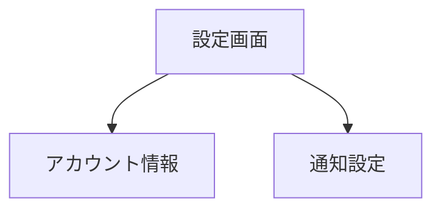

# 設定

サイドバーの「**設定**」を選択して表示します。
アカウント情報と通知の設定を管理する画面です。

> **注意**: この機能はログインモードでのみ利用できます。

---

## 画面の構成

---

## アカウント情報

現在ログインしているアカウントの情報が表示されます。

| 項目 | 内容 |
|------|------|
| **メールアドレス** | 登録済みのメールアドレス |

---

## 通知設定

各種通知のオン/オフを設定できます。

### 設定手順

1. 「**通知設定**」セクションを開きます
2. 通知を受け取りたい項目をオンにします
3. 通知が不要な項目をオフにします
4. 設定は自動的に保存されます

### 通知の種類

| 通知 | 説明 |
|------|------|
| **メール通知** | 重要な変更や通知をメールで受け取ります |
| **在庫アラート** | 在庫がしきい値を下回った場合に通知します |

---

## テーマの切り替え

画面のテーマ（ライトモード/ダークモード）はサイドバー上部のテーマ切替ボタンで変更できます。

> **補足**: テーマ設定は設定画面ではなく、サイドバーのボタンから操作します。
